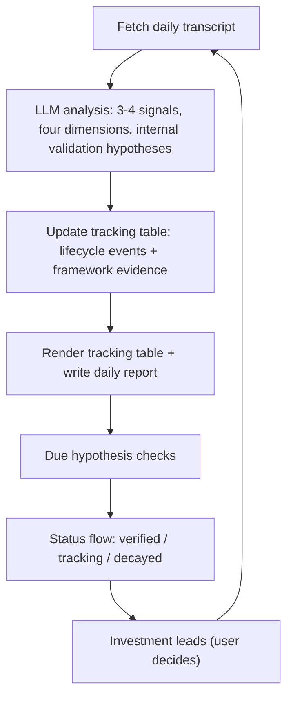

# China Signal · Xinwen Lianbo

> 看新闻联播，跟踪中国产业政策的叙事偏离

[中文版 README](./README.zh-CN.md)

---

> Everyone is reading *Xinwen Lianbo* — but what exactly are they looking for? This is my daily log of policy winds, industry transmission, and falsifiable hypothesis check-ins.

One evening in August, the nightly news described nuclear power with four words: *积极安全有序发展* — "actively, safely, orderly develop." Our system flagged it immediately: nuclear had just crossed from the **Competition** frame to the **Security** frame. Quiet on the surface. Big for anyone watching China's energy industry.

That's the kind of signal this project is built to catch.

## What this is

Every evening at 7pm, CCTV's 30-minute *Xinwen Lianbo* tells you — deliberately, in order, with chosen words — what the Chinese state wants to happen next. We treat it as a **policy signal channel**: not news to summarize, but a stream to mine.

Each day the pipeline:

1. Picks the **3-4 items** that actually carry policy (skipping obituaries, disasters, fluff)
2. Scores each signal: *who is speaking, is it new, does it have a concrete hook, when can we verify*
3. Writes a one-line **internal validation hypothesis**, e.g. "nuclear enters the Security frame → approval and construction pace becomes the next observable signal"
4. Tracks it in a rolling table and **verifies it later** — did the hypothesis hold, or die?

The question we answer is not "what happened today". It's **"which policy promises are quietly accelerating, being deprioritized, reframed, or silently walked back?"**

The public output is deviation detection across three layers: **plan → narrative → reality**. Internal validation hypotheses stay in the system as falsifiable metrics — they are not shown in the push summary and are not investment advice.

## What you get

A daily Markdown report + a structured tracking table (JSON + rendered). A real row from the tracking table:

| # | Theme | Level | Novelty | Specificity | Window | Frame | Verification |
|---|-------|-------|---------|-------------|--------|-------|--------------|
| 30 | Nuclear construction scale ranks No.1 globally | B | PROGRESS | S1 | Open | Security | New project starts (2026-11-12) |

> Policy-conduction logic: nuclear enters the Security frame (top priority) → approval and construction pace becomes the next observable real-workload checkpoint.

Full sample: [`reports/2026-08-12.md`](reports/2026-08-12.md)

## Start here

- Want to see what is currently tracked? Open [`tracking.md`](tracking.md)
- Want to understand the method and vocabulary? Open [`notes/如何看懂这份雷达.md`](notes/如何看懂这份雷达.md)
- Want the daily reports? Browse [`reports/`](reports/)

## How it works



The daily loop feeds the tracking table; verification results feed back into theme status; confirmed hypotheses graduate into trackable leads — then the loop repeats.

## Methodology (the important, slightly boring part)

**Four dimensions.** Every signal is scored independently — *Level* (who is speaking: leadership or ministry), *Novelty* (new direction or progress), *Specificity* (numbers/timelines/projects, or vague talk), *Verification window* (when we can check). Different combinations mean different actions.

**Policy window.** Kingdon's multiple streams: when the problem, the solution and the politics all align, concrete rules follow. Tracked as Open / Near / Closed.

**Narrative frames.** Security / Competition / Livelihood / Development. The frame reveals priority: Security = spare no cost, Competition = pour in resources to win, Livelihood = steady progress. **A frame migration is a strong signal** — that's exactly how we caught nuclear.

**Investment hypotheses, not event check-ins.** Every theme carries a falsifiable hypothesis; its verification condition is an event or data point that confirms or kills it. No ceremonial milestones, no circular tests.

**15th Five-Year Plan mapping.** Every signal is located in the plan's 18 parts / 62 chapters, so you always see the larger narrative behind the item.

The full design rationale in English: [`docs/methodology-en.md`](docs/methodology-en.md).

## Repository structure

```
├── scripts/
│   ├── common.py                   # shared utilities: atomic writes, corruption recovery, stats recompute
│   ├── fetch_xwlb.py               # fetch transcripts (CCTV primary + mrxwlb fallback)
│   ├── run_daily.py                # daily pipeline: fetch → LLM → update → render → notify
│   ├── render_tracking_table.py    # render full tracking table + automation digest
│   ├── backfill_xwlb.py            # batch backfill historical transcripts
│   ├── keyword_stats.py            # zero-LLM keyword frequency statistics
│   ├── verify_external.py          # external-source verification for due checkpoints
│   └── backtest_charts.py          # zero-dependency SVG charts
├── data/
│   ├── tracking_table.json         # single source of truth (structured)
│   ├── tracking_table_digest.md    # compact digest for automation (rendered)
│   ├── raw/                        # transcripts (gitignored, never committed)
│   └── backtest_stats/             # pure statistics + SVG charts (public-ready)
├── notes/
│   └── 如何看懂这份雷达.md          # human-readable guide: terms, legends, method, boundaries
├── tracking.md                     # auto-generated 5-column compact tracking table
├── reference/
│   ├── design.md                   # methodology design doc
│   ├── framework-dictionary.md     # narrative-frame judgment dictionary
│   ├── 15fyp-outline-reference.md  # 15th Five-Year Plan structure reference
│   └── initial_signal_tracking_table.md   # full tracking table (rendered, do not edit)
├── docs/
│   ├── automation_prompt.md        # public prompt for plugging into any LLM automation
│   ├── methodology-en.md           # plain-English methodology explainer
│   └── backtest/                   # historical-turn backtest plan and templates
├── reports/                        # daily reports (Markdown)
├── PROMPT.md                       # system prompt injected by run_daily.py
├── tests/                          # unit tests (stdlib unittest only)
└── .github/workflows/ci.yml        # syntax check + unit tests on push/PR
```

## Installation

**Requirements:** Python 3.9+ (3.11+ recommended). No third-party dependencies — all scripts use only the Python standard library (`requirements.txt` contains only comments, by design).

```bash
git clone <your-repo-url>
cd <your-repo>

python -m venv .venv            # optional
# Windows: .venv\Scripts\activate
# macOS/Linux: source .venv/bin/activate
```

Set the LLM credentials (required for the analysis pipeline):

| Variable | Required | Default | Notes |
|---|---|---|---|
| `LLM_API_KEY` | yes | — | API key from your LLM provider (any OpenAI-compatible endpoint) |
| `LLM_BASE_URL` | no | `https://api.deepseek.com` | Built-in default — replace with your provider's OpenAI-compatible URL |
| `LLM_MODEL` | no | `deepseek-chat` | Built-in default — replace with the model name you use |
| `NOTIFY_TYPE` | no | — | `serverchan` or `wecom` |
| `NOTIFY_WEBHOOK` | no | — | Webhook URL; scheme must be http/https |

## Usage

```bash
# Windows PowerShell: $env:LLM_API_KEY = "your_api_key"
export LLM_API_KEY=your_api_key

python scripts/run_daily.py                    # full pipeline on yesterday (Beijing time)
python scripts/run_daily.py --date 2026-08-12  # specific date
python scripts/run_daily.py --dry-run          # real fetch/LLM, all outputs to a temp dir
python scripts/run_daily.py --mock             # built-in sample response, no API call, temp dir output

python scripts/fetch_xwlb.py --date 2026-08-12 # fetch transcript only
python scripts/render_tracking_table.py        # re-render tracking table + digest
```

What the pipeline does each run:

1. Fetches the transcript (CCTV primary, mrxwlb fallback; both are quality-checked)
2. Calls the LLM; output is **schema-validated** and retried once with the error fed back
3. Updates the tracking table — stats are recomputed from the themes, file is written atomically with a `.bak` backup (corrupt files auto-recover)
4. Runs due verification checks and auto-flows theme status (tracking → delayed / decayed)
5. Renders the table + digest and writes the daily report
6. Sends an optional push notification — **never blocks the run**, so a bad webhook can't lose the day's data

`--dry-run` and `--mock` never touch real data: everything is written to a temp dir (override with `XWLB_TMP_ROOT`).

## Tests

```bash
python -m unittest discover -s tests -v
```

Covers atomic writes and `.bak` recovery, stats recomputation, LLM result validation, tracking-table updates and expiry checks, HTML parser fixtures, and render robustness.

## Historical backtest

The zero-LLM backtest replays three known policy turns from historical transcripts:

```bash
python scripts/backfill_xwlb.py --start 2024-01-01 --end 2025-12-31
python scripts/keyword_stats.py --start 2024-01-01 --end 2025-12-31
python scripts/backtest_charts.py
```

Outputs are pure statistics and SVG charts in `data/backtest_stats/`. Transcripts stay in `data/raw/` and are never committed.

## Automation

- This repo ships CI (`.github/workflows/ci.yml`): syntax check + unit tests on every push/PR.
- For the daily scheduled run, use `docs/automation_prompt.md` — a self-contained prompt for any LLM-driven scheduler — or drive `scripts/run_daily.py` from your own GitHub Actions / cron setup (see the file's docstring for the full command list).
- In a GitHub Actions setup, commit back only the generated outputs (`data/`, `reference/`, `reports/`, `tracking.md`). Configure `LLM_API_KEY` as a **secret**; `LLM_BASE_URL`, `LLM_MODEL`, `NOTIFY_TYPE` as **repo variables**; `NOTIFY_WEBHOOK` as a **secret**.

## Disclaimer

Research and education only. Analysis is based on publicly available broadcast transcripts and is **not investment advice**.

## License

GNU AGPL-3.0 (code, methodology, prompts, framework dictionary). Derivatives must stay open, including network services. See [LICENSE](LICENSE).
