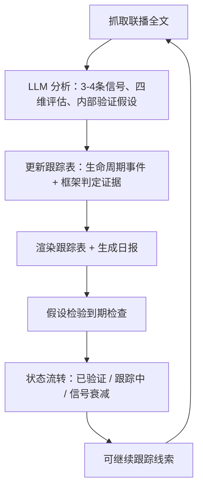

# 新闻联播风向标

[English README](./README.en.md)

---

> 大佬们都在看《新闻联播》，但到底在看什么？这里是我每天提炼的政策风向、产业传导和假设验证打卡。

8月的一个晚上，联播用四个字形容核电：**积极安全有序发展**。系统立刻标记了一件事——核电刚从"竞争框架"跨进了"安全框架"。表面风平浪静，对关注中国能源产业的人来说，这是优先级在变。

这个项目就是干这个的。

## 这是什么

每天晚上7点，央视用30分钟告诉你——用什么顺序、什么措辞、报道什么——国家下一步想干什么。我们把它当成一个**政策信号频道**：不是拿来复述的新闻，是拿来挖掘的数据流。

每天，管线会：

1. 从30分钟里挑出**真正带政策含义的3-4条**（跳过讣告、灾害、花絮）
2. 给每条信号打分：谁在说、是不是新方向、有没有抓手、多久能验证
3. 写一句**内部验证假设**，比如"核电进安全框架 → 核准与开工节奏成为下一步可观察信号"
4. 放进滚动跟踪表，**事后验证**——假设是成立还是死掉

我们回答的不是"今天发生了什么"，而是**"哪些政策承诺在悄悄加码、被搁置、被换框架，或者被静默改口？"**

公开产出是三层偏离检测：**规划 → 叙事 → 现实**。内部验证假设只作为系统自己的可证伪指标保留，不写进推送摘要，也不构成投资建议。

## 你能得到什么

一份日报（Markdown）+ 一张结构化跟踪表（JSON + 渲染）。跟踪表里的一行真实数据：

| # | 主题 | 层级 | 首次性 | 具体性 | 政策窗口 | 框架 | 验证点 |
|---|------|------|--------|--------|---------|------|--------|
| 30 | 核电工程建设规模居世界第一 | B | PROGRESS | S1 | 开放 | 安全框架 | 新项目开工（2026-11-12） |

> 政策传导逻辑：核电纳入安全框架（最高优先级）→ 核准与开工节奏是接下来可观察的实物工作量验证点

完整样例：[`reports/2026-08-12.md`](reports/2026-08-12.md)

## 从哪里开始读

- 想快速看今天在跟什么：打开 [`tracking.md`](tracking.md)
- 想读懂口径和方法：打开 [`notes/如何看懂这份雷达.md`](notes/如何看懂这份雷达.md)
- 想直接看每日报告：进入 [`reports/`](reports/)

## 运行闭环



日报喂给跟踪表，验证结果反馈到主题状态，被证实的假设晋级为可继续跟踪线索——第二天循环继续。

## 方法论（重要，但稍微有点枯燥）

**四维评估。** 每条信号独立打分——层级（谁在说：最高层还是部委）、首次性（新方向还是新进展）、具体性（有数字有时间表有项目，还是只有表态）、验证窗口（多久能验证）。不同组合意味着不同的行动。

**政策窗口。** Kingdon 多源流理论：问题、方案、政治时机三流齐备，细则就会来。跟踪为开放/接近/封闭。

**叙事框架。** 安全 / 竞争 / 民生 / 发展。框架暴露优先级：安全=不计成本，竞争=砸资源去赢，民生=稳步推进。**框架迁移是强信号**——抓核电靠的就是这个。

**内部验证假设。** 每个主题带一句可证伪的验证假设，验证条件是能证实或排除它的事件或数据。不要仪式性打卡，不要循环论证。

**十五五映射。** 每条信号都定位到纲要的18篇62章里，始终能看到报道背后的大叙事。

## 文件结构

```
├── scripts/
│   ├── common.py                   # 共享工具：原子写入、损坏恢复、统计重算
│   ├── fetch_xwlb.py               # 抓取联播全文（CCTV 主源 + mrxwlb 备份）
│   ├── run_daily.py                # 每日主流程：抓取 → LLM 分析 → 更新 → 渲染 → 推送
│   ├── render_tracking_table.py    # 渲染完整跟踪表与自动化摘要
│   ├── backfill_xwlb.py            # 批量回填历史文字稿
│   ├── keyword_stats.py            # 零 LLM 词频统计
│   ├── verify_external.py          # 外部官方源验证：到期检验点联网核验
│   └── backtest_charts.py          # 零依赖 SVG 曲线图
├── data/
│   ├── tracking_table.json         # 信号跟踪表唯一数据源（结构化）
│   ├── tracking_table_digest.md    # 自动化用紧凑摘要（渲染产物）
│   ├── raw/                        # 联播原文（已 gitignore，不入库）
│   └── backtest_stats/             # 纯统计 + SVG 曲线图（可公开）
├── notes/
│   └── 如何看懂这份雷达.md          # 人类阅读层：口径、图例、方法与边界
├── tracking.md                     # 自动生成的 5 列极简跟踪表
├── reference/
│   ├── design.md                   # 方法论设计文档
│   ├── framework-dictionary.md     # 叙事框架判定词典
│   ├── 15fyp-outline-reference.md  # 十五五纲要结构参考
│   └── initial_signal_tracking_table.md   # 完整跟踪表（渲染产物，勿手工编辑）
├── docs/
│   ├── automation_prompt.md        # 公开版 prompt，可粘贴到任意 LLM 自动化任务
│   ├── methodology-en.md           # 英文方法论说明文档
│   └── backtest/                   # 历史转向回测方案与模板
├── reports/                        # 每日日报（Markdown）
├── PROMPT.md                       # run_daily.py 注入 LLM 的系统指令
├── tests/                          # 单元测试（纯标准库 unittest）
└── .github/workflows/ci.yml        # push/PR 触发：语法检查 + 单元测试
```

## 安装步骤

**环境要求：** Python 3.9+（推荐 3.11+）。**零第三方依赖**——全部脚本仅使用 Python 标准库（`requirements.txt` 因此只有注释）。

```bash
git clone <你的仓库地址>
cd <你的仓库>

python -m venv .venv            # 可选
# Windows: .venv\Scripts\activate
# macOS/Linux: source .venv/bin/activate
```

配置 LLM 凭据（分析管线必需）：

| 变量 | 必填 | 默认值 | 说明 |
|---|---|---|---|
| `LLM_API_KEY` | 是 | — | 你的 LLM 服务商提供的 key（任意 OpenAI 兼容接口） |
| `LLM_BASE_URL` | 否 | `https://api.deepseek.com` | 代码内置默认；可换成你所用服务商的 OpenAI 兼容地址 |
| `LLM_MODEL` | 否 | `deepseek-chat` | 代码内置默认；可换成你所用服务商的模型名 |
| `NOTIFY_TYPE` | 否 | — | `serverchan` 或 `wecom` |
| `NOTIFY_WEBHOOK` | 否 | — | 推送 webhook 地址；协议必须是 http/https |

## 使用方法

```bash
# Windows PowerShell: $env:LLM_API_KEY = "你的key"
export LLM_API_KEY=你的key

python scripts/run_daily.py                    # 全流程分析昨日（北京时间）
python scripts/run_daily.py --date 2026-08-12  # 指定日期
python scripts/run_daily.py --dry-run          # 真实抓取/分析，但输出全部写入临时目录
python scripts/run_daily.py --mock             # 内置样例响应测试流程（不调 API，输出写入临时目录）

python scripts/fetch_xwlb.py --date 2026-08-12 # 只抓取
python scripts/render_tracking_table.py        # 只渲染
```

每次运行的流程：

1. 抓取联播全文（CCTV 主源 + mrxwlb 备份，两源都有质量校验）
2. 调用 LLM；输出经 **schema 校验**，失败会把错误回传重试一次
3. 更新跟踪表——统计基于主题**实时重算**，文件**原子写入**并留 `.bak` 备份（损坏自动恢复）
4. 执行假设检验到期检查，自动流转主题状态（跟踪中 → 延迟验证 / 信号衰减）
5. 渲染跟踪表与摘要，生成日报
6. 可选推送通知——**推送失败绝不阻断主流程**，坏 webhook 不会丢当天数据

`--dry-run` 与 `--mock` 不碰真实数据，全部输出写入临时目录（可用 `XWLB_TMP_ROOT` 指定目录）。

## 测试

```bash
python -m unittest discover -s tests -v
```

覆盖：原子写入与 `.bak` 恢复、统计重算、LLM 输出校验、跟踪表更新与到期检查、HTML 解析 fixture、渲染健壮性。

## 历史回测

零 LLM 回测用历史文字稿复盘三个已知政策转向：

```bash
python scripts/backfill_xwlb.py --start 2024-01-01 --end 2025-12-31
python scripts/keyword_stats.py --start 2024-01-01 --end 2025-12-31
python scripts/backtest_charts.py
```

输出为 `data/backtest_stats/` 下的纯统计与 SVG 图表；转录原文仍留在 `data/raw/`，永不提交。

## 自动化部署

- 本仓库自带 CI（`.github/workflows/ci.yml`）：每次 push/PR 自动做语法检查 + 单元测试。
- 每日定时运行：用 `docs/automation_prompt.md`（面向任意 LLM 调度任务的完整 prompt），或用你自己的 GitHub Actions / cron 驱动 `scripts/run_daily.py`（脚本 docstring 里有完整命令说明）。
- GitHub Actions 场景：只提交生成的产物（`data/`、`reference/`、`reports/`、`tracking.md`）；`LLM_API_KEY` 配成 **secret**，`LLM_BASE_URL` / `LLM_MODEL` / `NOTIFY_TYPE` 配成 **仓库变量**，`NOTIFY_WEBHOOK` 配成 **secret**。

## 免责声明

仅供研究学习，基于公开的《新闻联播》文字稿，**不构成投资建议**。

## 许可

GNU AGPL-3.0（含代码、方法论、prompt 与框架词典）：派生作品必须保持开源，网络服务亦然。详见 [LICENSE](LICENSE)。
