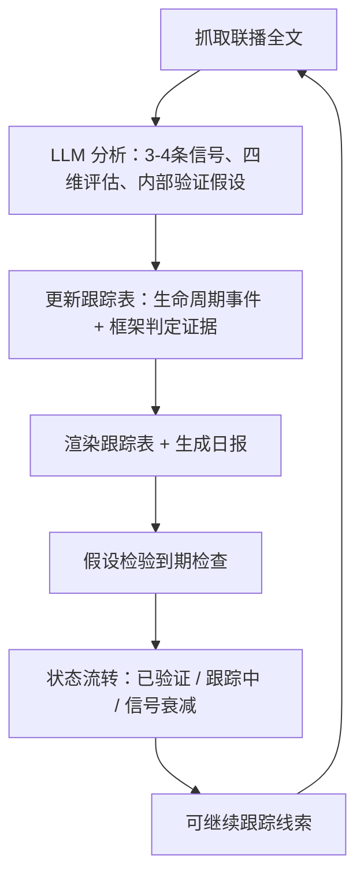

# 新闻联播风向标

[English README](./README.en.md)

---

> 大佬们都在看《新闻联播》，但到底在看什么？这里是我每天提炼的政策风向、产业传导和假设验证打卡。

8月的一个晚上，联播用四个字形容核电：**积极安全有序发展**。系统立刻标记了一件事——核电刚从"竞争框架"跨进了"安全框架"。表面风平浪静，对关注中国能源产业的人来说，这是优先级在变。

这个项目就是干这个的。

## 这是什么

每天晚上7点，央视用30分钟告诉你——用什么顺序、什么措辞、报道什么——国家下一步想干什么。我们把它当成一个**政策信号频道**：不是拿来复述的新闻，是拿来挖掘的数据流。

每天，管线会：

1. 从30分钟里挑出**真正带政策含义的3-4条**（跳过讣告、灾害、花絮）
2. 给每条信号打分：谁在说、是不是新方向、有没有抓手、多久能验证
3. 写一句**内部验证假设**，比如"核电进安全框架 → 核准与开工节奏成为下一步可观察信号"
4. 放进滚动跟踪表，**事后验证**——假设是成立还是死掉

我们回答的不是"今天发生了什么"，而是**"哪些政策承诺在悄悄加码、被搁置、被换框架，或者被静默改口？"**

公开产出是三层偏离检测：**规划 → 叙事 → 现实**。内部验证假设只作为系统自己的可证伪指标保留，不写进推送摘要，也不构成投资建议。

## 你能得到什么

一份日报（Markdown）+ 一张结构化跟踪表（JSON + 渲染）。跟踪表里的一行真实数据：

| # | 主题 | 层级 | 首次性 | 具体性 | 政策窗口 | 框架 | 验证点 |
|---|------|------|--------|--------|---------|------|--------|
| 30 | 核电工程建设规模居世界第一 | B | PROGRESS | S1 | 开放 | 安全框架 | 新项目开工（2026-11-12） |

> 政策传导逻辑：核电纳入安全框架（最高优先级）→ 核准与开工节奏是接下来可观察的实物工作量验证点

完整样例：[`reports/2026-08-12.md`](reports/2026-08-12.md)

## 从哪里开始读

- 想快速看今天在跟什么：打开 [`tracking.md`](tracking.md)
- 想读懂口径和方法：打开 [`notes/如何看懂这份雷达.md`](notes/如何看懂这份雷达.md)
- 想直接看每日报告：进入 [`reports/`](reports/)

## 运行闭环



日报喂给跟踪表，验证结果反馈到主题状态，被证实的假设晋级为可继续跟踪线索——第二天循环继续。

## 方法论（重要，但稍微有点枯燥）

**四维评估。** 每条信号独立打分——层级（谁在说：最高层还是部委）、首次性（新方向还是新进展）、具体性（有数字有时间表有项目，还是只有表态）、验证窗口（多久能验证）。不同组合意味着不同的行动。

**政策窗口。** Kingdon 多源流理论：问题、方案、政治时机三流齐备，细则就会来。跟踪为开放/接近/封闭。

**叙事框架。** 安全 / 竞争 / 民生 / 发展。框架暴露优先级：安全=不计成本，竞争=砸资源去赢，民生=稳步推进。**框架迁移是强信号**——抓核电靠的就是这个。

**内部验证假设。** 每个主题带一句可证伪的验证假设，验证条件是能证实或排除它的事件或数据。不要仪式性打卡，不要循环论证。

**十五五映射。** 每条信号都定位到纲要的18篇62章里，始终能看到报道背后的大叙事。

## 运行与部署

**环境要求：** Python 3.9+（推荐 3.11+），**零第三方依赖**——全部脚本仅用 Python 标准库（`requirements.txt` 只有注释）。

```bash
git clone <你的仓库地址>
cd <你的仓库>

python -m venv .venv            # 可选
# Windows: .venv\Scripts\activate
# macOS/Linux: source .venv/bin/activate

python scripts/run_daily.py --mock               # 不调 API，完整流程演示（输出写入临时目录）
python scripts/run_daily.py --date 2026-08-12    # 分析指定日期
python -m unittest discover -s tests -v          # 单元测试
```

真实分析需要 LLM 凭据（`LLM_API_KEY`，任意 OpenAI 兼容接口）。完整命令、环境变量、定时任务与 GitHub Actions 部署见 [`docs/automation_prompt.md`](docs/automation_prompt.md)；历史回测见 [`docs/backtest/`](docs/backtest/)。仓库自带 CI（`.github/workflows/ci.yml`），每次 push/PR 自动跑语法检查与单元测试。

## 免责声明

仅供研究学习，基于公开的《新闻联播》文字稿，**不构成投资建议**。

## 许可

GNU AGPL-3.0（含代码、方法论、prompt 与框架词典）：派生作品必须保持开源，网络服务亦然。详见 [LICENSE](LICENSE)。
