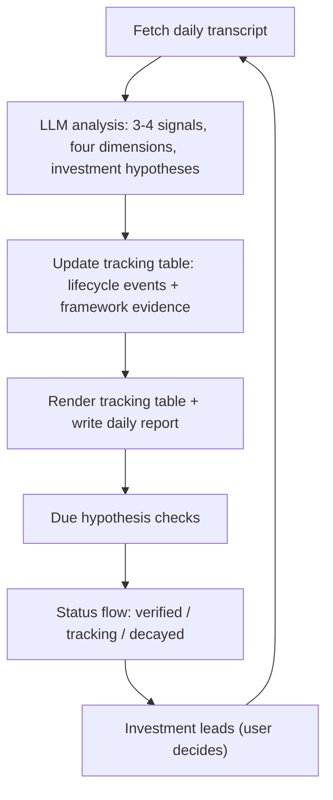

# Seek China Opportunities from Xinwen Lianbo

> 看新闻联播寻中国机会

[中文版 README](./README.zh-CN.md)

---

One evening in August, the nightly news described nuclear power with four words: *积极安全有序发展* — "actively, safely, orderly develop." Our system flagged it immediately: nuclear had just crossed from the **Competition** frame to the **Security** frame. Quiet on the surface. Big for anyone watching China's energy industry.

That's the kind of signal this project is built to catch.

## What this is

Every evening at 7pm, CCTV's 30-minute *Xinwen Lianbo* tells you — deliberately, in order, with chosen words — what the Chinese state wants to happen next. We treat it as a **policy signal channel**: not news to summarize, but a stream to mine.

Each day the pipeline:

1. Picks the **3-4 items** that actually carry policy (skipping obituaries, disasters, fluff)
2. Scores each signal: *who is speaking, is it new, does it have a concrete hook, when can we verify*
3. Writes a one-line **investment hypothesis**, e.g. "nuclear enters the Security frame → faster approvals → orders for nuclear equipment"
4. Tracks it in a rolling table and **verifies it later** — did the hypothesis hold, or die?

The question we answer is not "what happened today". It's **"which industry is gaining momentum, and how far along is it?"**

## What you get

A daily Markdown report + a structured tracking table (JSON + rendered). A real row from the tracking table:

| # | Theme | Level | Novelty | Specificity | Window | Frame | Verification |
|---|-------|-------|---------|-------------|--------|-------|--------------|
| 30 | Nuclear construction scale ranks No.1 globally | B | PROGRESS | S1 | Open | Security | New project starts (2026-11-12) |

> Hypothesis: nuclear enters the Security frame (top priority) → approval/construction pace decides order flow for nuclear equipment, construction and operators.

Full sample: [`reports/2026-08-12.md`](reports/2026-08-12.md)

## How it works



The daily loop feeds the tracking table; verification results feed back into theme status; confirmed hypotheses graduate into investment leads — then the loop repeats.

## Methodology (the important, slightly boring part)

**Four dimensions.** Every signal is scored independently — *Level* (who is speaking: leadership or ministry), *Novelty* (new direction or progress), *Specificity* (numbers/timelines/projects, or vague talk), *Verification window* (when we can check). Different combinations mean different actions.

**Policy window.** Kingdon's multiple streams: when the problem, the solution and the politics all align, concrete rules follow. Tracked as Open / Near / Closed.

**Narrative frames.** Security / Competition / Livelihood / Development. The frame reveals priority: Security = spare no cost, Competition = pour in resources to win, Livelihood = steady progress. **A frame migration is a strong signal** — that's exactly how we caught nuclear.

**Investment hypotheses, not event check-ins.** Every theme carries a falsifiable hypothesis; its verification condition is an event or data point that confirms or kills it. No ceremonial milestones, no circular tests.

**15th Five-Year Plan mapping.** Every signal is located in the plan's 18 parts / 62 chapters, so you always see the larger narrative behind the item.

*For non-China watchers: the method is language-agnostic — swap the broadcast source and the frame dictionary, and it works for any country's official media.*

## Quick Start

Requirements: Python 3.9+ (standard library only) and an OpenAI-compatible LLM API key (e.g., DeepSeek).

```bash
export LLM_API_KEY=your_api_key
python scripts/run_daily.py            # fetch yesterday, analyze, update table, write report

python scripts/run_daily.py --date 2026-08-12   # specific date
python scripts/fetch_xwlb.py --date 2026-08-12  # fetch only
python scripts/render_tracking_table.py          # render only
```

Optional: set `NOTIFY_TYPE` (`serverchan` / `wecom`) and `NOTIFY_WEBHOOK` to get a short summary pushed after each run.

## Data & compliance

- Sources: CCTV (primary) + mrxwlb.com (fallback mirror). Scripts use only the Python standard library.
- Transcripts are copyrighted by CCTV. **This repo contains analysis only, never transcripts** (`data/raw/` is gitignored).

## Disclaimer

Research and education only. Analysis is based on publicly available broadcast transcripts and is **not investment advice**.

## License

GNU AGPL-3.0 (code, methodology, prompts, framework dictionary). Derivatives must stay open, including network services. See [LICENSE](LICENSE).
