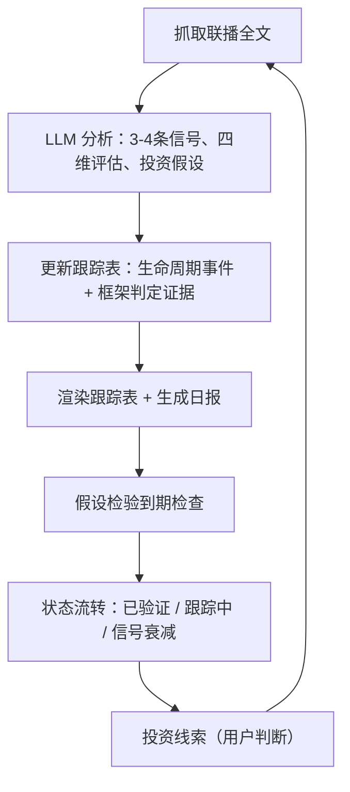

# 看新闻联播寻中国机会

[English README](./README.md)

---

8月的一个晚上，联播用四个字形容核电：**积极安全有序发展**。系统立刻标记了一件事——核电刚从"竞争框架"跨进了"安全框架"。表面风平浪静，对关注中国能源产业的人来说，这是优先级在变。

这个项目就是干这个的。

## 这是什么

每天晚上7点，央视用30分钟告诉你——用什么顺序、什么措辞、报道什么——国家下一步想干什么。我们把它当成一个**政策信号频道**：不是拿来复述的新闻，是拿来挖掘的数据流。

每天，管线会：

1. 从30分钟里挑出**真正带政策含义的3-4条**（跳过讣告、灾害、花絮）
2. 给每条信号打分：谁在说、是不是新方向、有没有抓手、多久能验证
3. 写一句**投资假设**，比如"核电进安全框架 → 核准提速 → 核电设备订单"
4. 放进滚动跟踪表，**事后验证**——假设是成立还是死掉

我们回答的不是"今天发生了什么"，而是**"哪个产业在积蓄势能、走到哪一步了？"**

## 你能得到什么

一份日报（Markdown）+ 一张结构化跟踪表（JSON + 渲染）。跟踪表里的一行真实数据：

| # | 主题 | 层级 | 首次性 | 具体性 | 政策窗口 | 框架 | 验证点 |
|---|------|------|--------|--------|---------|------|--------|
| 30 | 核电工程建设规模居世界第一 | B | PROGRESS | S1 | 开放 | 安全框架 | 新项目开工（2026-11-12） |

> 投资假设：核电纳入安全框架（最高优先级）→ 核准与开工节奏决定核电设备/建设/运营产业链订单起点

完整样例：[`reports/2026-08-12.md`](reports/2026-08-12.md)

## 运行闭环



日报喂给跟踪表，验证结果反馈到主题状态，被证实的假设晋级为投资线索——第二天循环继续。

## 方法论（重要，但稍微有点枯燥）

**四维评估。** 每条信号独立打分——层级（谁在说：最高层还是部委）、首次性（新方向还是新进展）、具体性（有数字有时间表有项目，还是只有表态）、验证窗口（多久能验证）。不同组合意味着不同的行动。

**政策窗口。** Kingdon 多源流理论：问题、方案、政治时机三流齐备，细则就会来。跟踪为开放/接近/封闭。

**叙事框架。** 安全 / 竞争 / 民生 / 发展。框架暴露优先级：安全=不计成本，竞争=砸资源去赢，民生=稳步推进。**框架迁移是强信号**——抓核电靠的就是这个。

**投资假设验证。** 每个主题带一句可证伪的投资假设，验证条件是能证实或杀死它的事件或数据。不要仪式性打卡，不要循环论证。

**十五五映射。** 每条信号都定位到纲要的18篇62章里，始终能看到报道背后的大叙事。

*给不关心中国的人：这套方法是语言无关的——换掉新闻源和框架词典，任何国家的官方媒体都能套用。*

## 快速开始

要求：Python 3.9+（仅标准库）和 OpenAI 兼容的 LLM API key（如 DeepSeek）。

```bash
export LLM_API_KEY=你的key
python scripts/run_daily.py            # 抓取昨日 → 分析 → 更新跟踪表 → 生成日报

python scripts/run_daily.py --date 2026-08-12   # 指定日期
python scripts/fetch_xwlb.py --date 2026-08-12  # 只抓取
python scripts/render_tracking_table.py          # 只渲染
```

可选：设置 `NOTIFY_TYPE`（`serverchan` / `wecom`）和 `NOTIFY_WEBHOOK`，每次运行后推送简报。

## 数据源与合规

- 主源：CCTV 央视网；备份：mrxwlb.com；脚本零第三方依赖（纯标准库）
- 联播原文版权归 CCTV；**本仓库只含分析成果，不含原文**（`data/raw/` 已 gitignore）

## 免责声明

仅供研究学习，基于公开的《新闻联播》文字稿，**不构成投资建议**。

## 许可

GNU AGPL-3.0（含代码、方法论、prompt 与框架词典）：派生作品必须保持开源，网络服务亦然。详见 [LICENSE](LICENSE)。
